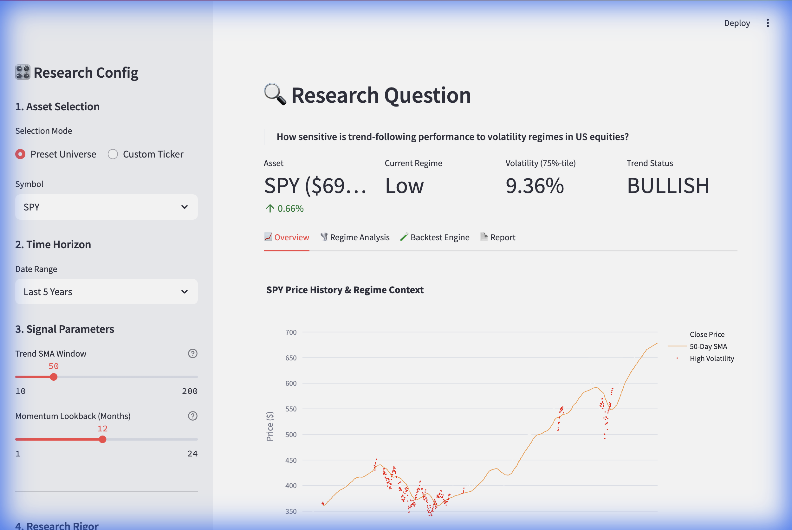
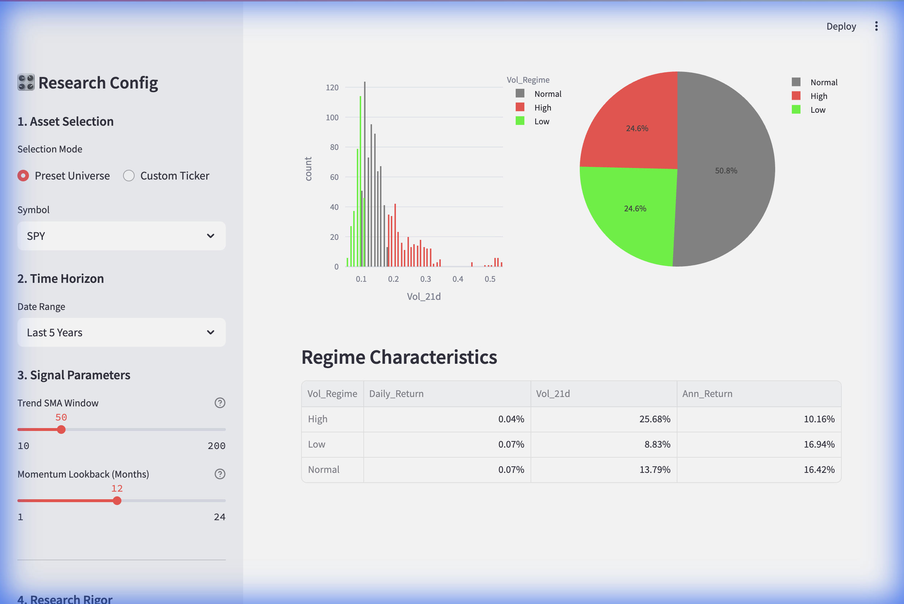
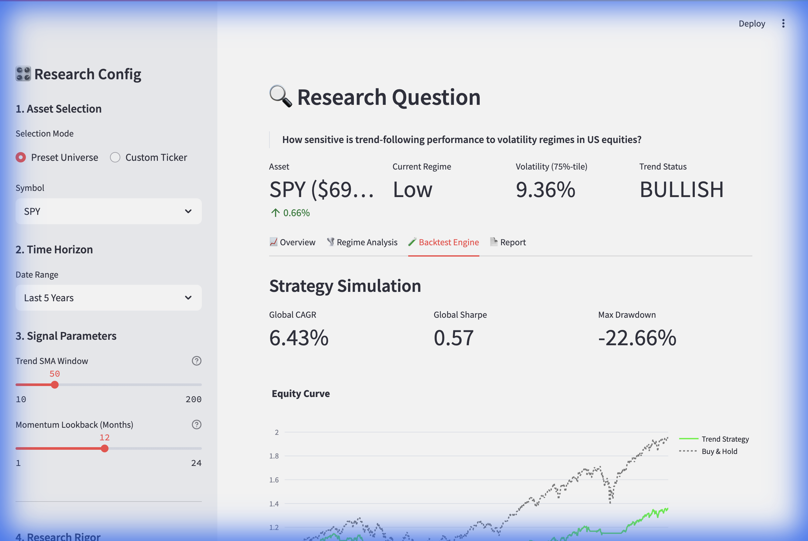
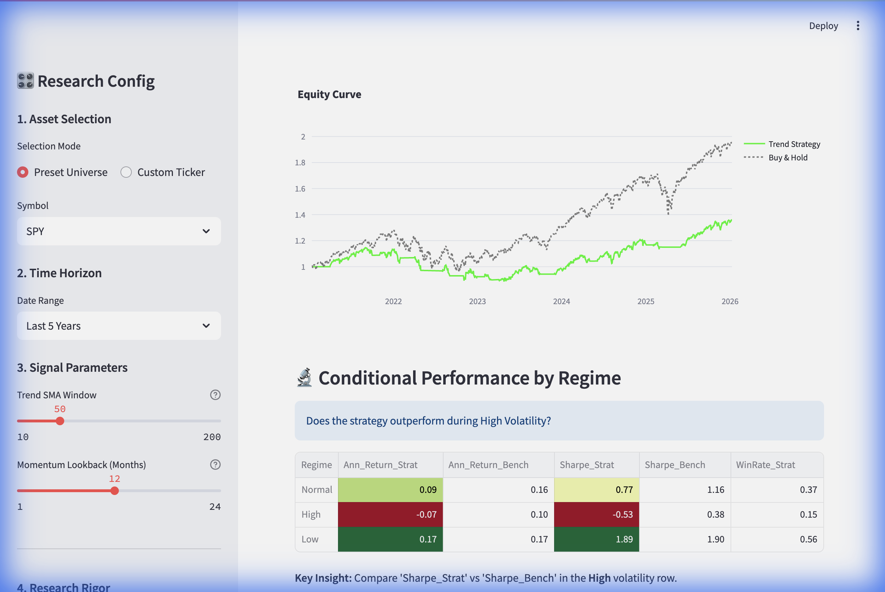
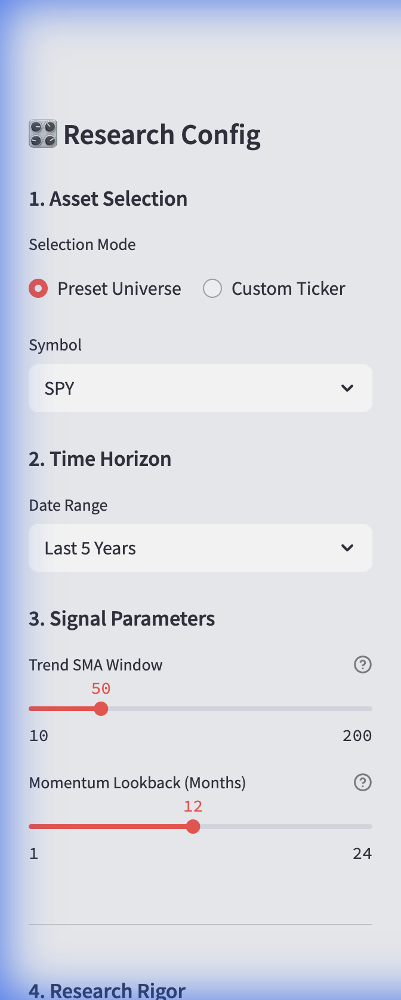

# 📸 Dashboard Demonstration Guide

This guide provides a visual walkthrough of the HedgeFund Dashboard, showing each feature with screenshots and explanations.

---

## 🖥️ Dashboard Overview

The dashboard is built with Streamlit and provides an interactive research environment for quantitative momentum analysis. It's organized into four main tabs with a configuration sidebar.

---

## 📊 Tab 1: Overview



### What You're Seeing:

**Header Metrics (Top Row):**
| Metric | Value | Meaning |
|:---|:---|:---|
| **Asset** | SPY ($694.07) | Current price with daily change (+0.66%) |
| **Current Regime** | Low | Volatility is in the bottom 25th percentile |
| **Volatility (75%-tile)** | 9.36% | Current 21-day annualized volatility |
| **Trend Status** | BULLISH | Price is above the 50-day SMA |

**Price Chart:**
- **White line**: Historical close price
- **Orange line**: 50-day Simple Moving Average (SMA)
- **Red shaded areas**: High volatility regime periods (when volatility > 75th percentile)

**Key Insight:** The chart shows that high volatility periods (red) often coincide with significant market drawdowns. The trend-following strategy attempts to avoid these periods.

---

## 🌪️ Tab 2: Regime Analysis



### What You're Seeing:

**Volatility Distribution Histogram (Left):**
- Shows the distribution of 21-day volatility values
- Color-coded by regime: **Red** = High, **Gray** = Normal, **Green** = Low
- Notice the right tail (high volatility events are rare but extreme)

**Pie Chart (Right):**
| Regime | Time Spent |
|:---|:---|
| Normal | 50.8% |
| High | 24.6% |
| Low | 24.6% |

**Regime Characteristics Table:**
| Regime | Daily Return | Volatility | Annualized Return |
|:---|:---|:---|:---|
| High | 0.04% | 25.68% | 10.16% |
| Low | 0.07% | 8.83% | 16.94% |
| Normal | 0.07% | 13.79% | 16.42% |

**Key Insight:** High volatility periods (25% of the time) have lower returns despite higher risk. This supports the research hypothesis that trend-following can add value by avoiding these periods.

---

## 🧪 Tab 3: Backtest Engine

### Part A: Metrics & Equity Curve



**Top Metrics Row:**
| Metric | Value | Interpretation |
|:---|:---|:---|
| **Global CAGR** | 6.43% | Compound annual growth rate of the strategy |
| **Global Sharpe** | 0.57 | Risk-adjusted return (decent, but not exceptional) |
| **Max Drawdown** | -22.66% | Largest peak-to-trough decline |

These metrics are calculated with **Bootstrap Confidence Intervals** when out-of-sample mode is enabled, showing statistical uncertainty.

### Part B: Conditional Performance



**Equity Curve Chart:**
- **Green line**: Trend-following strategy equity
- **Gray dashed line**: Buy & Hold benchmark
- Notice how the strategy flat-lines during major drawdowns (2022 bear market)

**Conditional Performance by Regime Table:**

| Regime | Strat Return | Bench Return | Strat Sharpe | Bench Sharpe | Win Rate |
|:---|:---|:---|:---|:---|:---|
| **Normal** | 0.09 | 0.16 | 0.77 | 1.14 | 0.37 |
| **High** | -0.07 | 0.10 | -0.53 | 0.38 | 0.15 |
| **Low** | 0.17 | 0.17 | 1.89 | 0.38 | 0.56 |

**Key Insight:** 
- The strategy **underperforms** in Normal and High volatility (lower Sharpe)
- The strategy **outperforms** in Low volatility (Sharpe 1.89 vs 0.38)
- This is the "whipsaw cost" of trend-following in choppy markets

---

## ⚙️ Sidebar Controls



### Configuration Sections:

**1. Asset Selection**
- Choose from preset universe (SPY, QQQ, etc.) or enter custom ticker
- Supports stocks, ETFs, and crypto (BTC-USD, ETH-USD)

**2. Time Horizon**
- Last 5 Years, Last 10 Years, Max, or Custom date range
- Longer periods provide more statistical significance

**3. Signal Parameters**
- **Trend SMA Window** (10-200 days): Sensitivity of trend signal
  - Lower = more responsive, more trades, more whipsaw
  - Higher = smoother, fewer trades, more lag
- **Momentum Lookback** (1-24 months): Period for momentum calculation

**4. Research Rigor**
- **Regime Classification**: Toggle for volatility regime detection
- **High Volatility Quantile** (0.5-0.95): Threshold for "high" classification

**5. Backtest Settings**
- **Transaction Cost** (bps): Cost per trade (10 bps = 0.10%)
- **Allow Short Selling**: Long-only vs Long/Short mandate

---

## 🔬 Understanding the Research Question

> **"How sensitive is trend-following performance to volatility regimes in US equities?"**

### The Dashboard Answers This By:

1. **Segmenting** historical data into High/Normal/Low volatility periods
2. **Running** a trend-following backtest across the full period
3. **Decomposing** returns to show performance IN EACH REGIME
4. **Calculating** statistical metrics (Sharpe, Sortino, Win Rate) per regime

### Typical Research Finding:

| Market Condition | Trend Strategy | Why? |
|:---|:---|:---|
| **Crashes (High Vol)** | ✅ Outperforms | Goes to cash when price < SMA |
| **Bull Markets (Low Vol)** | ✅ Often Matches | Stays invested when price > SMA |
| **Sideways (Normal Vol)** | ❌ Underperforms | Whipsawed by false signals |

---

## 🚀 Advanced Features

### Walk-Forward Validation

Located in the Backtest Engine tab (expandable section), this feature:
- Splits data into rolling train/test windows (e.g., 24-month train, 6-month test)
- Evaluates strategy on each out-of-sample period
- Aggregates results to show true out-of-sample performance
- Helps distinguish skill from luck

### Bootstrap Confidence Intervals

The Sharpe ratio is displayed with 95% confidence intervals:
```
Sharpe (95% CI): 0.57 [0.31, 0.83]
```

This shows the statistical uncertainty around the point estimate. If the CI includes zero, the strategy may not be statistically significant.

### Drawdown Analysis

An expandable section showing:
- Underwater equity chart (how deep and how long drawdowns last)
- Maximum drawdown duration (trading days)
- Average drawdown duration

---

## 🎯 Recommended Research Workflow

1. **Start with SPY** on 10-year data for baseline
2. **Set SMA to 50 days** and momentum to 12 months
3. **View Overview** tab to understand current market state
4. **Check Regime Analysis** to see volatility distribution
5. **Run Backtest** and compare Sharpe ratios in conditional table
6. **Enable Out-of-Sample Mode** for rigorous results
7. **Run Walk-Forward Validation** to confirm robustness
8. **Experiment** with different assets (QQQ, BTC-USD) and parameters
9. **Export data** from Report tab for further analysis

---

## 📁 File Locations

| File | Purpose |
|:---|:---|
| `src/dashboard.py` | Main Streamlit application |
| `src/modules/signals.py` | Technical indicator calculations |
| `src/modules/backtester.py` | Strategy simulation engine |
| `src/modules/config.py` | Centralized configuration |
| `docs/DEMO.md` | This documentation |

---

*Generated on 2026-01-11*
